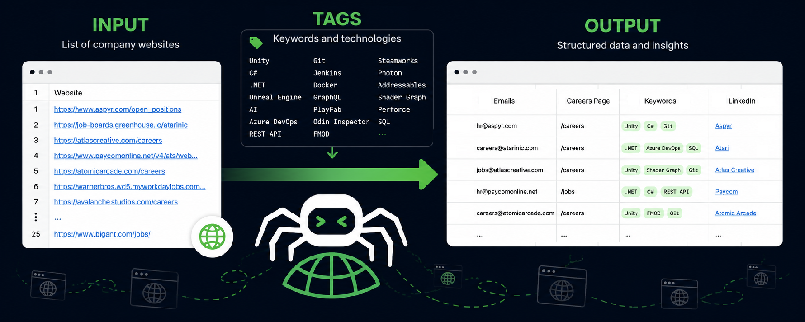
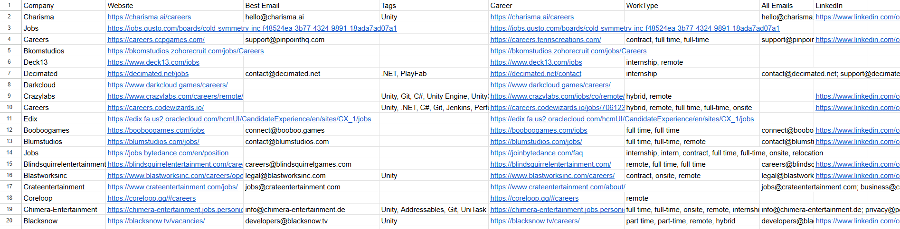

# CompanyCrawler

> Crawl company websites, find career pages and emails, analyze keywords, and export everything into a CSV.




---

# What is CompanyCrawler?

CompanyCrawler is a configurable website crawler built for researching companies at scale.

Give it a CSV containing company websites, choose a preset, and the crawler will automatically explore each domain, analyze its pages, and generate a report with useful information.

The project was originally created for job hunting, but the crawler itself is generic. Some behavior is controlled through JSON presets, allowing different workflows without changing code.

---

# Why?

Researching companies manually is slow.

Opening hundreds of websites just to answer questions like:

- Is this company hiring?
- Where is their careers page?
- What technologies do they use?
- Is there an HR email?
- Do they support remote work?
- What industry are they in?

...gets repetitive very quickly.

CompanyCrawler automates the process.

---

# Features

## Career Page Detection

Automatically finds pages related to:

- Careers
- Jobs
- Vacancies
- Hiring
- Recruitment
- Company Culture

---

## Email Discovery

Extracts company emails and automatically ranks them by relevance.

Examples:

- `hr@company.com`
- `jobs@company.com`
- `careers@company.com`
- `recruitment@company.com`

Higher quality contacts appear first in the final report.

---

## Keyword Analysis

Analyze websites for any keywords or phrases.

Examples:

- Unity
- Unreal Engine
- Mobile Games
- AI
- Blockchain
- SaaS

---

## External Link Detection

Extracts external company profiles such as:

- LinkedIn
- GitHub
- Upwork
- HH.ru
- Glassdoor
- Indeed



---

## JSON Presets

Crawler behavior is configurable through JSON presets.

A preset controls:

- Crawl depth
- Maximum pages
- Keyword analyzers
- Scoring
- Output columns
- Link categories

Different workflows can be created without touching the code.

---

# Installation / Download

[## Download CompanyCralwer from releases](https://github.com/S0dya/CompanyCrawler/releases/download/%2C/CompanyCrawler-v1.0.1.zip)

or

## Clone the repository

```bash
git clone https://github.com/S0dya/CompanyCrawler.git
```
Build

```bash
dotnet restore
dotnet build
```

### Windows may show a SmartScreen warning because the application is unsigned.
The source code is public and can be reviewed on GitHub.

---

## Change Tags in the data folders

```
Data
├── Input
├── Output
├── Presets
├── Tags
└── DownloadedHtml
```

---

## Prepare the input CSV / TXT file

Create:

```
Data/Input/companies.csv
/
Data/Input/companies.txt
```

Example:

### csv:
```csv
Website
https://www.supercell.com
https://www.playrix.com
https://www.riotgames.com
```

### txt:
```txt
https://www.supercell.com
https://www.playrix.com
https://www.riotgames.com
```
---

## (OPTIONAL) Configure a preset

Place preset files inside:

```
Data/Presets
```

Example:

```
Data/Presets/JobHunting.json
```

Presets define:

- Analyzers
- Scoring
- Keywords
- Crawl limits
- Output columns

---

# Run

launch:

```
CompanyCrawler.exe
```

or

Using the CLI:

```bash
dotnet run
```

---

Results are saved to:

```
Data/Output
```

---

# How Crawling Works

For every company:

1. Download the homepage.
2. Parse internal links.
3. Locate the sitemap.
4. Crawl discovered pages.
5. Detect important pages.
6. Extract emails.
7. Analyze keywords.
8. Export results.

---

# Limitations

CompanyCrawler is intentionally lightweight.

Some websites may:

- Block crawlers
- Load content dynamically
- Hide emails behind forms
- Require JavaScript
- Require authentication

Playwright support exists, but some websites cannot be analyzed perfectly.

---

# Why Open Source?

I originally built CompanyCrawler to automate my own job search.

If you've ever spent hours opening company websites one by one, hopefully this project saves you some time.

Feel free to modify the presets, extend the analyzers, or adapt it for your own workflow.

---

# License

Licensed under the **MIT License**.
